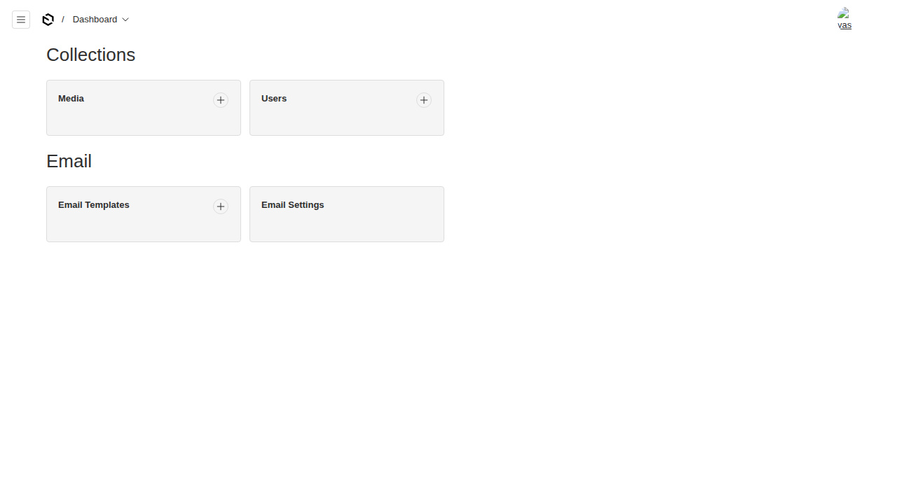
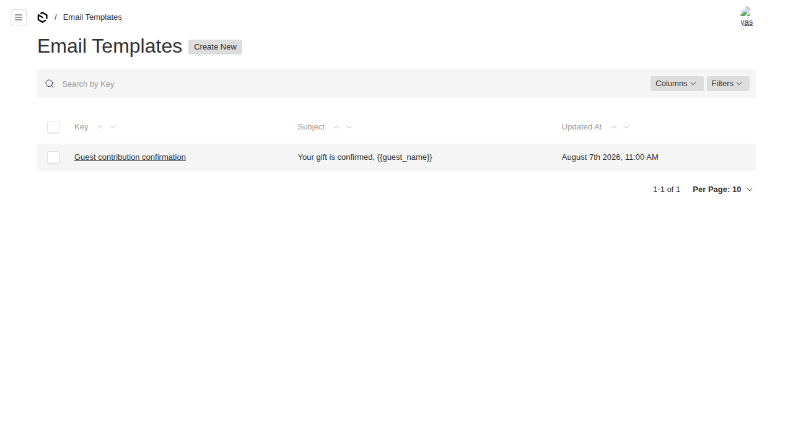
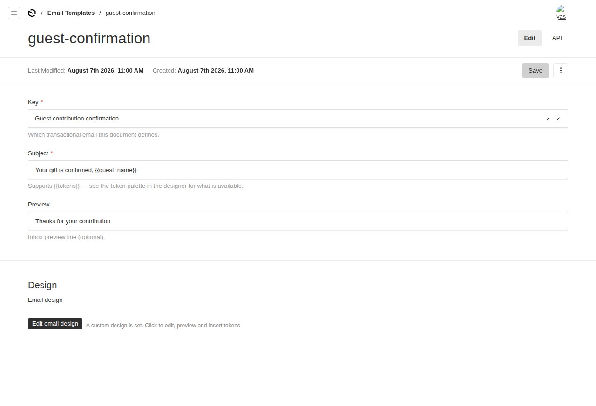
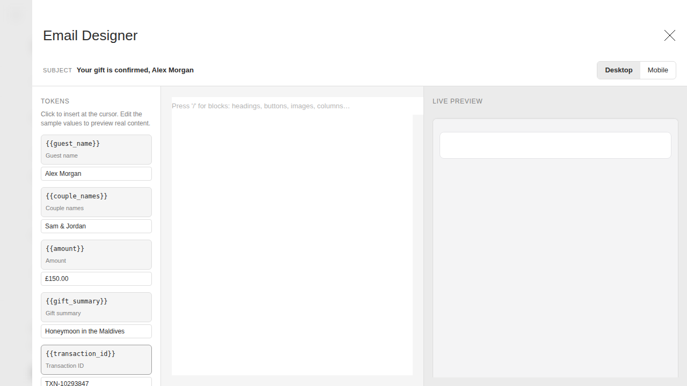
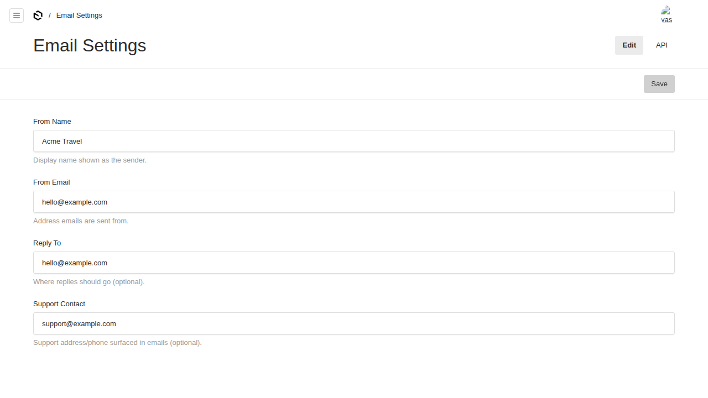

# @foundrykit/email-plugin

Templated transactional email for [Payload CMS 3](https://payloadcms.com) with a **visual, drag-and-drop email designer** built into the admin panel. Editors design emails with a live preview, insert `{{tokens}}` from a per-template palette, and your app sends them at runtime with the values filled in.

Extracted from the Turquoise project and generalised so every template, token and brand detail is configuration — nothing is hard-coded.

## Features

- **Visual email designer** — a [React Email](https://react.email) editor in a full-screen drawer, with slash-command blocks (headings, buttons, images, columns…), a token palette, editable sample data, a desktop/mobile toggle and a live preview.
- **Config-driven templates** — declare your templates and their available tokens in one place; each becomes a selectable `key` on the `email-templates` collection.
- **Token substitution** — `{{token}}` values are substituted at send time, HTML-escaped in the HTML part and left raw in the text part. Unknown/typo tokens stay visible rather than silently blanking.
- **Email-safe shell** — designer output is dropped into a styled, centered, email-client-safe card (inline styles + `<style>` fallback). Fully themeable, or disable it entirely.
- **Two entries added for you** — an `email-templates` collection and an optional `email-settings` global (sender identity + support contact), both grouped under a configurable admin group.
- **Server helpers** — `renderTemplate`, `sendEmail` and a pre-bound `createEmailRenderer` for use in collection hooks.
- **Adapter-agnostic** — sending goes through `payload.sendEmail`, so it works with whatever email adapter you already configure (`@payloadcms/email-nodemailer`, Resend, etc.).

## Screenshots

**Admin dashboard — the configurable `Email` group**



**Email Templates list**



**Template edit view** — `Key`, `Subject` (with tokens), `Preview`, and the designer trigger



**Visual email designer** — token palette + editable samples (left), editor (centre), live preview (right); the subject preview updates with the sample values



**Email Settings global**



---

## Installation

```sh
pnpm add @foundrykit/email-plugin
```

**Peer dependencies** (install if not already present):

```sh
pnpm add payload react @react-email/editor
```

> `@react-email/editor` is only needed for the admin designer UI. It's an optional peer — server-only usage (rendering/sending) doesn't require it.

---

## Quick start

```ts
// payload.config.ts
import { emailPlugin } from '@foundrykit/email-plugin'
import { nodemailerAdapter } from '@payloadcms/email-nodemailer'
import { buildConfig } from 'payload'

export const emailConfig = {
  adminGroup: 'Email',
  branding: {
    fromName: 'Acme Travel',
    fromEmail: 'hello@acme.com',
  },
  templates: [
    {
      key: 'order-confirmation',
      label: 'Order confirmation',
      defaultSubject: 'Your order is confirmed, {{first_name}}',
      fallbackHtml: '<h1>Thanks {{first_name}}!</h1><p>Your order {{order_id}} is confirmed.</p>',
      tokens: [
        { name: 'first_name', label: 'First name', sample: 'Alex' },
        { name: 'order_id', label: 'Order ID', sample: 'ORD-1024' },
        { name: 'amount', label: 'Amount', sample: '£150.00' },
      ],
    },
  ],
}

export default buildConfig({
  // Configure any Payload email adapter — the plugin sends via payload.sendEmail
  email: nodemailerAdapter({ /* … */ }),
  plugins: [emailPlugin(emailConfig)],
  // …
})
```

Then run `payload generate:importmap` so the designer's admin component is registered (Payload does this automatically on `dev`/build once the plugin is in your config).

### Sending an email

Reuse the same config object so the collection slug, templates and shell stay in sync:

```ts
import { createEmailRenderer } from '@foundrykit/email-plugin'
import { emailConfig } from './payload.config'

const email = createEmailRenderer(emailConfig)

// e.g. inside an afterChange hook once an order is paid:
await email.sendTemplate(req.payload, {
  key: 'order-confirmation',
  to: order.customerEmail,
  values: {
    first_name: order.firstName,
    order_id: order.reference,
    amount: '£150.00',
  },
})
```

`sendTemplate` looks up the stored design for that `key`, substitutes the tokens into the subject/HTML/text, and dispatches through your configured adapter. Prefer to send yourself? Use `renderTemplate(payload, key, values)` to get `{ subject, html, text }` and call `sendEmail` (or your own transport) directly.

### Only-send-once guard

`shouldSend` is a small idempotency helper for status-change notifications, so re-saves and retries don't re-send:

```ts
import { shouldSend } from '@foundrykit/email-plugin'

if (shouldSend(previousDoc.status, doc.status, doc.notifiedAt)) {
  await email.sendTemplate(payload, { /* … */ })
  // then record doc.notifiedAt
}
```

---

## Configuration

```ts
emailPlugin({
  templates: EmailTemplateDef[]          // required — at least one
  slugs?: {
    emailTemplates?: string              // default 'email-templates'
    emailSettings?: string               // default 'email-settings'
  }
  adminGroup?: string                    // default 'Email'
  settingsGlobal?: boolean               // default true — add the email-settings global
  branding?: {                           // seeded onto the settings global
    fromName?: string
    fromEmail?: string
    replyTo?: string
    supportContact?: string
  }
  access?: {                             // templates collection access (default: authenticated)
    read?; create?; update?; delete?
  }
  shell?: EmailShellOptions | false      // wrapper styling, or false to send unwrapped
  disabled?: boolean
})
```

### `EmailTemplateDef`

| Field | Type | Notes |
|---|---|---|
| `key` | `string` | Unique lookup key + `key` select value. |
| `label` | `string` | Shown in the admin `Key` dropdown. |
| `defaultSubject?` | `string` | Used when a document has no subject. Supports `{{tokens}}`. |
| `tokens` | `TokenDef[]` | `{ name, label, sample }` — populate the designer palette and the live preview. |
| `fallbackHtml?` | `string` | HTML (with `{{tokens}}`) used when a document has no saved design. Shell-wrapped automatically. |

### `EmailShellOptions`

`fontStack`, `pageBackground`, `cardBackground`, `cardBorder`, `textColor`, `linkColor`, `maxWidth` (px, default 600). Pass `shell: false` to send the designer's HTML unwrapped.

---

## How it works

- The `email-templates` collection stores each template's `subject`, `preview`, and a `design` group. The designer writes three siblings: `design.json` (editor document), `design.html` (shell-wrapped, ready to send) and `design.text` (plain-text alternative). The HTML/text fields are hidden — they're managed for you.
- At send time, `renderTemplate` finds the document by `key`, substitutes tokens, and returns `{ subject, html, text }`. If no design has been saved yet it falls back to the template's `fallbackHtml`, then to a minimal shell-wrapped body.
- Sending always goes through `payload.sendEmail`, so the plugin never needs to know about your transport.

## Exports

- `@foundrykit/email-plugin` — `emailPlugin`, `createEmailRenderer`, `renderTemplate`, `sendEmail`, `shouldSend`, `applyTokens`, `formatCurrency`/`formatPence`, `createEmailShell`/`wrapEmailHtml`, `htmlToText`, the collection/global factories, and all types.
- `@foundrykit/email-plugin/client` — `EmailDesignerField`, `EmailDesignerWorkspace` (registered via the import map; you don't import these yourself).

## Development

```sh
pnpm install
pnpm dev              # dev admin at http://localhost:3000/admin (sqlite, seeded)
pnpm test             # unit + integration + e2e
pnpm test:unit        # vitest (pure utilities)
pnpm test:int         # vitest against a real Payload instance
pnpm test:e2e         # playwright — boots the admin and captures the screenshots above
pnpm build            # dist (types + swc)
pnpm verify:pack      # pack + resolve every published entrypoint in a sandbox
```

The dev harness uses `@payloadcms/db-sqlite` so it needs no external database.

## License

MIT © Isaac SJ / Umi
